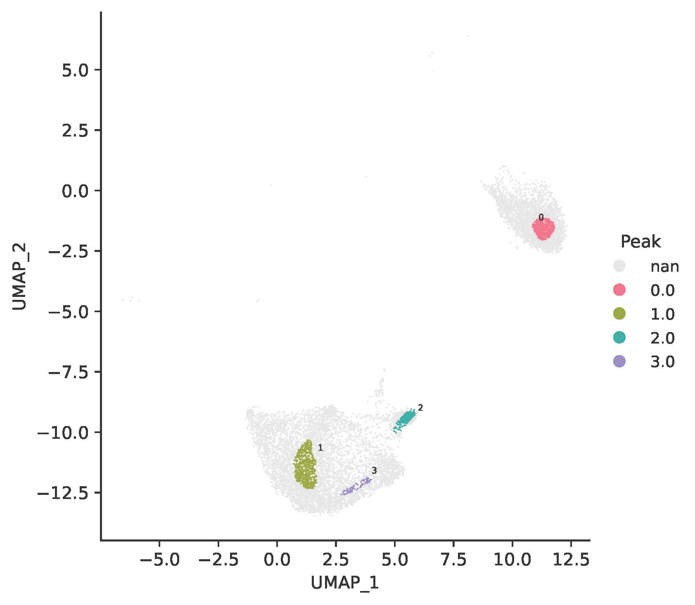
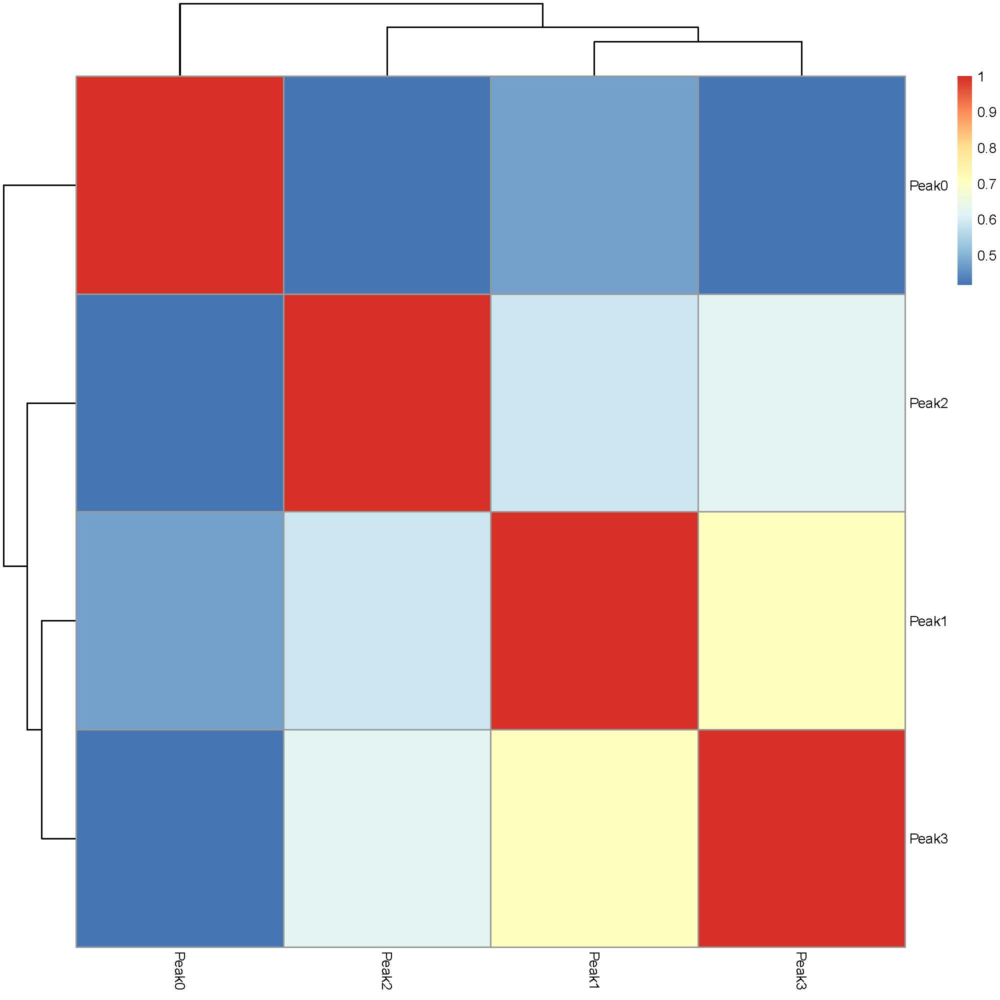
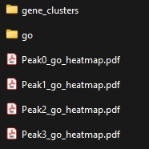
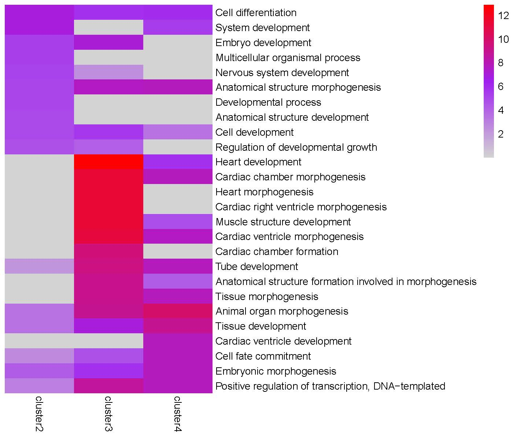
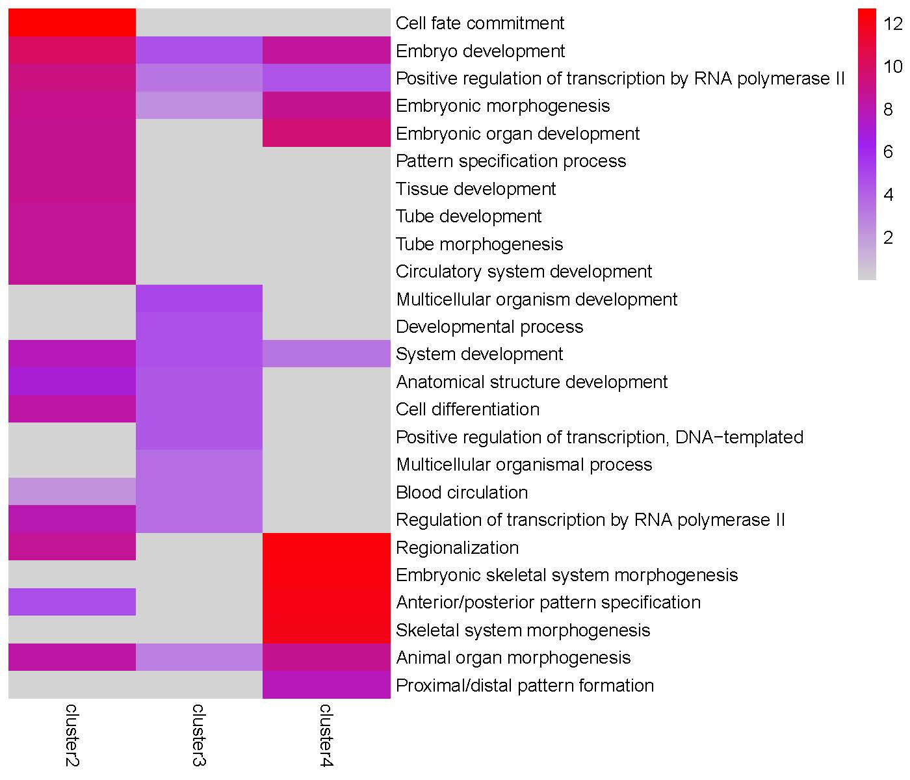
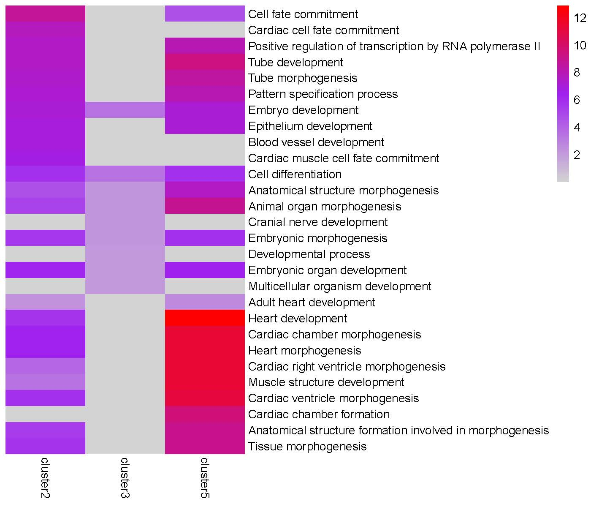
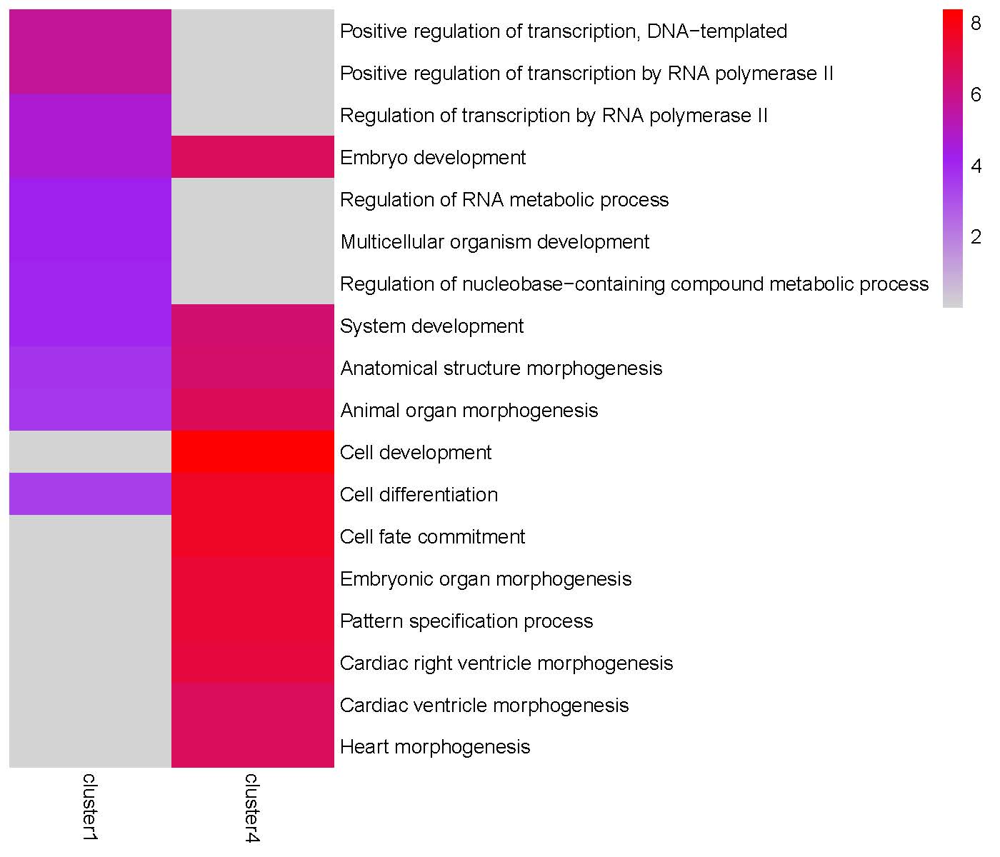

Case Study
===========

This case study demonstrates the application of the TRIAGE analysis pipeline using a publicly available single-nucleus RNA sequencing (snRNA-seq) dataset.

**Data Source:** 

- Dataset: `Kuppe et al., Nature 2022, Spatial multi-omic map of human myocardial infarction <https://www.nature.com/articles/s41586-022-05060-x>`_.
- Data Available at: `https://www.nature.com/articles/s41586-022-05060-x#data-availability <https://www.nature.com/articles/s41586-022-05060-x#data-availability>`_
- The demonstration uses control endothelial and pericyte cells to showcase the TRIAGE analysis pipeline.

Objective: To apply `TRIAGEcluster` for cell clustering, `byPeak()` for calculating average expression data by various categories, `TRIAGEgene` for generating TRIAGE-weighted expression data, `plotJaccard()` for Jaccard Index Heatmap visualization, `TRIAGEparser` for dissecting gene clusters and their associated ontologies, `plotGO()` for GO enrichment visualization, and `getClusterGenes()` for the extraction of genes from TRIAGEparser clusters.

**Steps:**

1. `TRIAGEcluster` + `byPeak()`
2. `TRIAGEgene` + `plotJaccard()`
3. `TRIAGEparser` + `plotGO()`
4. `getClusterGenes()`

.. code-block:: R

    # Load packages and set up the working directory
    library(TRIAGE)
    library(reticulate)
    setwd("/path/to/working/directory")

**Step 1:** Run `TRIAGEcluster` for cell clustering, select a suitable bandwidth resolution based on UMAP reviews, and calculate average gene expression by various categories using the `byPeak()` function.

.. code-block:: R

    # Run TRIAGEcluster
    expr_file <- system.file("extdata", "TRIAGEcluster_demo_expr_human.csv", package = "TRIAGE")
    metadata_file <- system.file("extdata", "TRIAGEcluster_demo_metadata_human.csv", package = "TRIAGE")
    TRIAGEcluster(expr_file, metadata_file, outdir = "tests", output_prefix = "demo")

    # Select a suitable bandwidth and calculate average gene expression
    peak_file <- "tests/demo_bw0.80_metadata.csv"
    avg_peak <- byPeak(expr_file, peak_file)
    # Save the average gene expression result to a CSV file
    write.csv(avg_peak, file = "tests/AverageByPeak.csv", row.names = TRUE, quote = FALSE)

TRIAGEcluster generates nine UMAPs with bandwidths from 0.1 to 0.9, and a corresponding set of metadata files. Here, a bandwidth of 0.8 was selected for downstream application, resulting in four TRIAGEcluster-defined peaks within the UMAP.

A snippet of the "AverageByPeak.csv" file is shown below:

+---------+------------+------------+------------+------------+
|         | Peak0      | Peak1      | Peak2      | Peak3      |
+=========+============+============+============+============+
| ALDH1A2 | 0.04404541 | 0.04426352 | 1.18265890 | 0.12415153 |
+---------+------------+------------+------------+------------+
| PRRX1   | 0.63263328 | 0.19289223 | 0.08957362 | 0.11108879 |
+---------+------------+------------+------------+------------+
| NOVA2   | 0.00785169 | 0.31212372 | 0.22311596 | 0.28179011 |
+---------+------------+------------+------------+------------+
| NGFR    | 0.07502976 | 0.01140611 | 0.01078702 | 0.02280367 |
+---------+------------+------------+------------+------------+
| MCF2L   | 0.03431053 | 1.41983845 | 0.25927713 | 1.39706381 |
+---------+------------+------------+------------+------------+
| TBX4    | 0          | 0          | 0          | 0          |
+---------+------------+------------+------------+------------+
| ...     | ...        | ...        | ...        | ...        |
+---------+------------+------------+------------+------------+

**Step 2:** Run `TRIAGEgene` to generate TRIAGE-weighted expression data and `plotJaccard()` to generate Jaccard similarity index heatmap.

.. code-block:: R

    # Run TRIAGEgene to generate TRIAGE-weighted expression data (DS)
    ds <- TRIAGEgene(avg_peak)
    # Save the average DS result to a CSV file
    write.csv(ds, file = "tests/AverageByPeak_DS.csv", row.names = TRUE, quote = FALSE)
    # Save the average DS result to a tab-delimited text file
    write.table(ds, file = "tests/AverageByPeak.txt", sep = "\t", 
                row.names = TRUE, col.names = NA, quote = FALSE)

    # Extract the top 10 genes for each TRIAGE peak
    top_genes <- topGenes(ds, top_no = 10)

    # Generate Jaccard Index Heatmap
    plotJaccard(ds, "tests/Jaccard_heatmap_peak.pdf")

A snippet of the "AverageByPeak_DS.csv" file is shown below:

+---------+----------------+----------------+----------------+----------------+
|         | Peak0          | Peak1          | Peak2          | Peak3          |
+=========+================+================+================+================+
| ALDH1A2 | 0.000685619    | 0.000689014    | 0.018409486    | 0.001932566    |
+---------+----------------+----------------+----------------+----------------+
| PRRX1   | 0.019265802    | 0.005874214    | 0.002727817    | 0.003383026    |
+---------+----------------+----------------+----------------+----------------+
| NOVA2   | 0.000207595    | 0.008252406    | 0.005899082    | 0.0074504      |
+---------+----------------+----------------+----------------+----------------+
| NGFR    | 0.012602077    | 0.001915782    | 0.001811799    | 0.003830128    |
+---------+----------------+----------------+----------------+----------------+
| MCF2L   | 0.000594645    | 0.024607587    | 0.004493599    | 0.024212873    |
+---------+----------------+----------------+----------------+----------------+
| TBX4    | 0              | 0              | 0              | 0              |
+---------+----------------+----------------+----------------+----------------+
| ...     | ...            | ...            | ...            | ...            |
+---------+----------------+----------------+----------------+----------------+

The plotJaccard() function generates a heatmap to visualize the extent of similarity across identified peaks:

**Step 3:** Run `TRIAGEparser` to dissect gene clusters and their associated ontologies and `plotGO()` to generate GO enrichment heatmaps.

.. code-block:: R

    # Run TRIAGEparser to dissect gene clusters and their associated ontologies
    input_file <- "tests/AverageByPeak_DS.csv"
    TRIAGEparser(input_file, input_type = "table", outdir="tests/TRIAGEparser_peak")

    # Generate GO Heatmaps
    plotGO(indir="tests/TRIAGEparser_peak", outdir="tests/TRIAGEparser_peak")    

The TRIAGEparser output comprises gene clusters and their associated Gene Ontology (GO) enrichments, which are organized into two separate folders named “gene_cluster” and “go”. The plotGO() function generates heatmaps for gene clusters in each peak. The folder structure is illustrated below:

GO enrichment heatmap for the 'Peak0' cluster:

GO enrichment heatmap for the 'Peak1' cluster:

GO enrichment heatmap for the 'Peak2' cluster:

GO enrichment heatmap for the 'Peak3' cluster:

**Step 4:** Since the Peak3 cluster4 is highly enriched in 'Cell differentiation' and 'Cell fate commitment' terms, we use `getClusterGenes()` to extract genes from this gene cluster for further downstream analysis.

.. code-block:: R

    # Extract genes from Peak3 cluster4
    Peak3_cluster4_genes <- getClusterGenes("tests/TRIAGEparser_peak/gene_cluster/Peak3_gene_clusters.csv", "cluster4")    

**Alternative Calculations 1: Average Gene Expression by Cluster:**

Objective: To calculate average gene expression based on cluster categories using `byPeak()` function, followed by `TRIAGEgene` analysis and Jaccard index heatmap generation.

.. code-block:: R

    expr_file <- system.file("extdata", "TRIAGEcluster_demo_expr_human.csv", package = "TRIAGE")
    peak_file <- "tests/demo_bw0.80_metadata.csv"

    # Calculate average gene expression by cluster
    avg_cluster <- byPeak(expr_file, peak_file, peak_col = "final_cluster")
    write.csv(avg_cluster, file = "tests/AverageByCluster.csv", row.names = TRUE, quote = FALSE)

    # Run TRIAGEgene
    ds_cluster <- TRIAGEgene(avg_cluster)
    write.csv(ds_cluster, file = "tests/AverageByCluster_DS.csv", row.names = TRUE, quote = FALSE)

    # Generate Jaccard index heatmap
    plotJaccard(ds_cluster, "tests/Jaccard_heatmap_cluster.pdf")

    # Run TRIAGEparser
    input_file <- "tests/AverageByCluster_DS.csv"
    TRIAGEparser(input_file, input_type = "table", outdir="tests/TRIAGEparser_cluster")

    # Generate GO Heatmaps
    plotGO(indir="tests/TRIAGEparser_cluster", outdir="tests/TRIAGEparser_cluster")   

**Alternative Calculations 2: Average Gene Expression by Cell Type**

Objective: To calculate average gene expression based on cell type categories using `byPeak()` function, followed by `TRIAGEgene` analysis and Jaccard index heatmap generation.

.. code-block:: R

    expr_file <- system.file("extdata", "TRIAGEcluster_demo_expr_human.csv", package = "TRIAGE")
    peak_file <- "tests/demo_bw0.80_metadata.csv"

    # Calculate average gene expression by cell type
    avg_celltype <- byPeak(expr_file, peak_file, peak_col = "cell_type")
    write.csv(avg_celltype, file = "tests/AverageByCelltype.csv", row.names = TRUE, quote = FALSE)

    # Run TRIAGEgene
    ds_celltype <- TRIAGEgene(avg_celltype)
    write.csv(ds_celltype, file = "tests/AverageByCelltype_DS.csv", row.names = TRUE, quote = FALSE)

    # Generate Jaccard index heatmap
    plotJaccard(ds_celltype, "tests/Jaccard_heatmap_celltype.pdf")

    # Run TRIAGEparser
    input_file <- "tests/AverageByCelltype_DS.csv"
    TRIAGEparser(input_file, input_type = "table", outdir="tests/TRIAGEparser_celltype")

    # Generate GO Heatmaps
    plotGO(indir="tests/TRIAGEparser_celltype", outdir="tests/TRIAGEparser_celltype")
